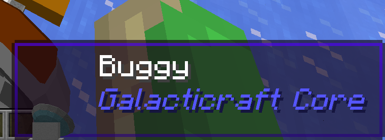
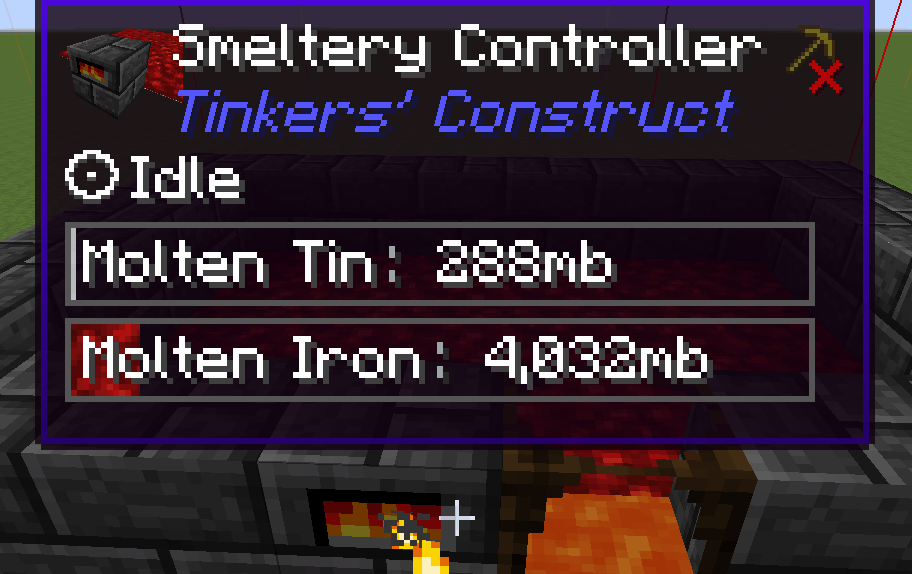
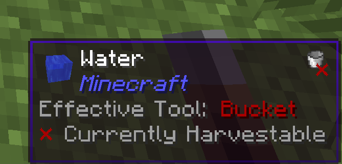

# WDMla
**What DreamMaster looks at** is what you look at 
The current state of the mod: 

# Main Features
- Allows rich non-text expression like item, entity, progress bar
- 3D block and entity icons!

- Backported many code features from Jade mod including new and fast registration system
- 2D layout codebase makes layout creation more flexible (was using ones from The One Probe, slowly rewriting to original)
- Better config screen and options
- Now includes features from WailaHarvestability and Wawla (both are reimplemented, WailaPlugins is planned)

- Achieved almost full backward compatibility by keeping legacy Waila api

# Supported mods
- almost every mods that Waila supports
- almost every mods that supports Waila
- And more...?

# Install step
Remove

- Waila (bundled)
- Waila Harvestability (bundled)

from your mods folder, than throw [GTNHLib](https://github.com/GTNewHorizons/GTNHLib/releases/latest) and this mod into it 
Your Waila config will be applied to WDMla automatically. 
No, NEI is no longer required

# Partial Incompatibilities
- Wawla -> required to disable most configs due to feature overlapping
  - wawla.harvest.showTool
  - wawla.harvest.showHarvest
  - wawla.harvest.showTier
  - wawla.harvest.showProgress
  - wawla.beacon.showLevels
  - wawla.beacon.showPrimary
  - wawla.beacon.showSecondary
  - wawla.furnace.input
  - wawla.furnace.output
  - wawla.furnace.fuel
  - wawla.furnace.burntime
  - wawla.showHead
  - wawla.info.showhardness
  - wawla.info.showResistance
  - wawla.showEquipment
  - wawla.showMobArmor
  - wawla.pets.showOwner
  - wawla.pets.sitting
  - wawla.pets.age
  - wawla.pets.cooldown
  - wawla.horse.showjump
  - wawla.horse.showspeed
  - wawla.tnt.fuse
  - wawla.showProfession

# Other items to Note:
- Enchant Screen has been removed
- NEI ore dictionary search function has been removed (GTNH NEI has this by default)

# Credits
- [Jade](https://github.com/Snownee/Jade) 
  - Backported many codes under the same license
- [The One Probe](https://github.com/McJtyMods/TheOneProbe)
  - Backported some HUD component codes under [MIT license](https://github.com/McJtyMods/TheOneProbe/blob/1.20/LICENCE)
- [Refined Storage 2](https://github.com/refinedmods/refinedstorage2)
  - Uses some ui icons under [MIT license](https://github.com/refinedmods/refinedstorage2/blob/develop/LICENSE.md)

How far did we progress?: https://github.com/Quarri6343/Wdmla/compare/2f738bc...master
